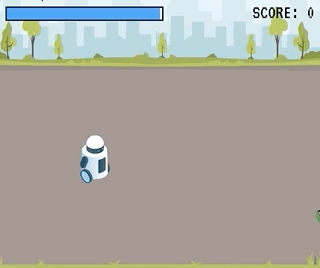

# Programmeren 8 - Herkansingstoets A

## "Trash Collector"

> In deze game bestuur je een troep-verzamel-robot. Probeer binnen de tijd zoveel mogelijk rotzooi op te pakken. Maar let op! Van bananen glibber je omver en van spijkers loop je helemaal vast!


> De paprika's vinden het niet fijn om opgeraapt te worden. Ze kijken behoorlijk boos. Maar als ze zien dat de robot uitglijdt over een banaan moeten ze lachen!



## Checklist voor uploaden

- Let op de deadline
- Uploaden op [Cumlaude](https://lms.hr.nl)
- Plaat de foto van het klassendiagram in de hoofdmap
- Vul het [verantwoordingsdocument](./verantwoordingsdocument.md) volledig in volgens de eisen van de beoordelingscriteria
- Maak een zip-bestand van de hoofdmap. Zet in de bestandsnaam van de zip je naam

## Opdracht

- **Blikjes, spijkers, paprika's en bananen** worden rechts buiten beeld gegenereerd en schuiven dan naar links. Als ze links buiten beeld gaan worden ze uit het spel verwijderd.
- Als de robot vuilnis oppakt verdwijnt het vuilnis en krijg je een punt.
- Beweeg de vuilnisrobot met W A S D of de cursortoetsen. 
- Na het oppakken van:
    - Banaan : de robot glibbert langzaam omlaag en is niet bestuurbaar. 
    - Spijkers : de robot knippert rood en is niet bestuurbaar. 
    - In beide situatie zal de robot na 2 seconden weer terugvallen op zijn standaard gedrag. De besturing is zal dan weer met W A S D zijn. 
- De paprika's kijken boos. Maar als ze zien dat de robot uitglijdt krijgen ze de lachende afbeelding.
- De UI toont de tijd en de score. 
- De game stopt als de tijd op is.

## Startcode

- Je krijgt startcode voor de game met een bestuurbare robot, de achtergrond en een blikje. Het UI component toont de aflopende tijd.
- Vergeet niet de Typescript compiler aan te zetten met CMD/CTRL+SHIFT+B

## Code tips

**Animatie**

Verander de paprika afbeelding van boos naar lachend met
```typescript
this.classList.add("smiling")
```
Je zou `math.sin` kunnen gebruiken om de robot te laten zwabberen nadat hij een banaan oppakt:
```typescript
this.counter++
this.xspeed = Math.sin(this.counter/5) * 10 
this.yspeed = Math.random() * 2
```
Maak de robot rood met een CSS filter:
```typescript
this.style.filter = `hue-rotate(150deg)`
```

**Web components**

Voorbeeld `Car` component:
```typescript
class Car extends HTMLElement {
    constructor() {
        super()
        document.body.appendChild(this)
    }
}
window.customElements.define("car-component", Car as any)
```
Component toevoegen en verwijderen uit de DOM:
```typescript
let c = new Car()
c.remove()
```
Een component kan zichzelf verwijderen uit de DOM:
```typescript
this.remove()
```

**Random positie**
```typescript
let y = 200 + (Math.random() * (window.innerHeight - this.clientHeight - 200))
```

**Stop gameloop bij game over**
```typescript
private gameLoop(){
    if(gameOver) {
        console.log("game over")
    } else {
        requestAnimationFrame(()=>this.gameLoop())
    }
}
```

**Collision detection**

Van een web component kan je als volgt de bounding box opvragen:

```typescript
let car = new Car()
let rectangle = car.getBoundingClientRect() 
```
Gebruik deze functie om te zien of twee bounding boxes elkaar raken:
```typescript
private checkCollision(a: ClientRect, b: ClientRect) {
    return (a.left <= b.right &&
        b.left <= a.right &&
        a.top <= b.bottom &&
        b.top <= a.bottom)
}
```


